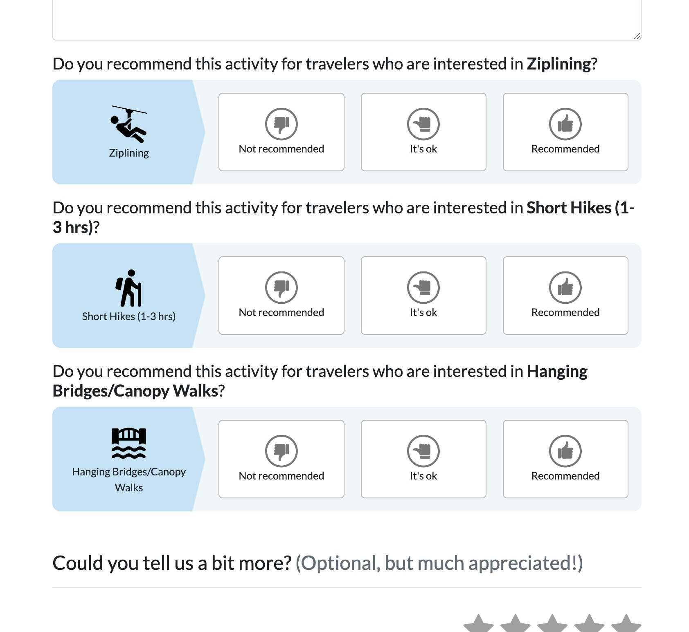
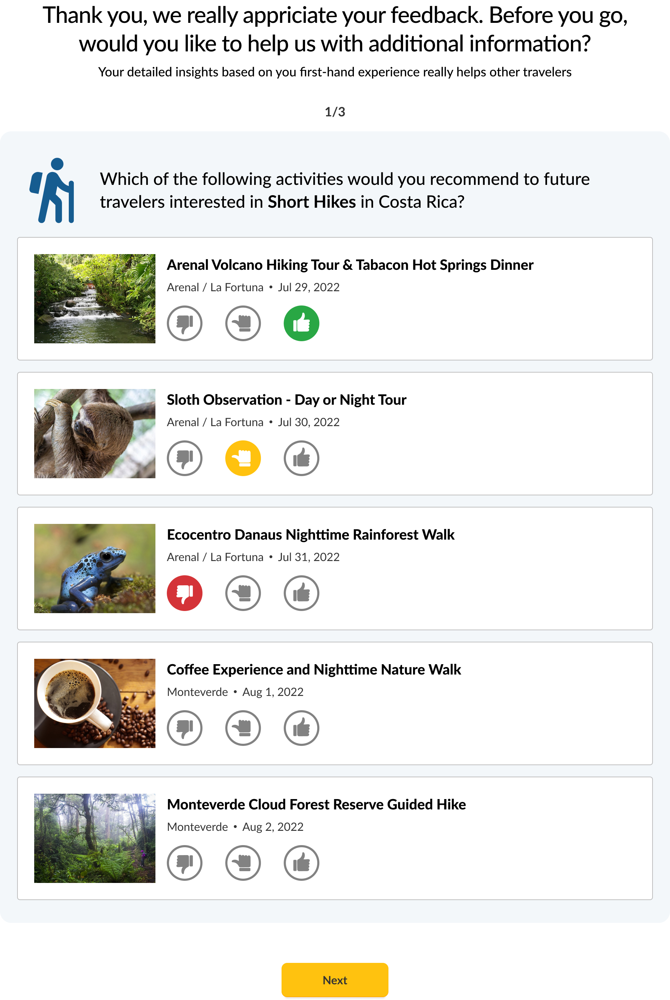

Activity Feature Ratings
========================

When travelers return from their trip, we ask them to write a review of the trip, the activities, and the hotels (all separate reviews).

For each activity, we ask a number of questions, a 1-5 rating, how well it rates on certain dimensions
(the authenticity, the staff/guides, was it a nice location, if there was food how was it, etc )

The goal of this project is to extend this review flow and allow travelers to give us more review information about the activities they did on their trip, 
by asking them to rate how well certain activities matched their interests. (more below).

## Interview Format & Deliverables
Our goal is to mimic a typical project as best we can, specifically the early stage of an engineering spec/design review to highlight and discuss key architectural additions or changes.

Please prepare by familiarizing yourself with this mock spec (this is a real project we are working on, w/ a few things simplified). 
Then we will set up a call to talk through it together and your proposed approach: how would you structure this on the DB and backend side? 
What questions do you have? What tradeoffs can/should we make?

### Deliverables
For the purpose of this project, do not worry about the front end (you can describe page flows if helpful in your notes).

We are more interested in the back end architecture for the new ratings,
as well as how you plan to get the lists of features to request ratings for a given activity (part 1),
and the list of features and their activities to ask about in part 2.

Please put together a document to best communicate your approach and ideas. In some cases it may be helpful to include pseudocode (or code in a language you are familiar with) to get your ideas accross.

Send this doc to me before the interview so that I can familiarize myself with it and prepare appropriate questions. Then we will set up a call.

### Technical Interview Call
On the call, I'll ask you to walk me through the approach, tradeoffs you made and why you made them. I'll also ask abotu how to handle some requirement changes.

Be prepared to write a bit of code based on where the discussion leads. It doesn't need to be production-ready by any means, 
more of a way to see how the different decisions/flows/logic could be implemented.


### Questions?
Please reach out w/ any questions at any time, just as you would for any other typical project. 

We are a hybrid, async team, and written communication is important as well.

It's not a good sign if you have no questions to ask.

---

## Project
There are 2 parts to this project:
1. We want to add a new section to the Activity Review form to to ask more about how each activity 
matched up with the expectations based on their interests by adding a new section to the Activity Review form page.
2. We want to add a few follow up questions after all activities are reviewed that ask about their interests in general.

The business logic for each case will be outlined below.

For all trip features we ask about, we want to limit this list to only those that were originally part of the traveler's requested/interested trip_feature.

For example, let's say a traveler said they care about wildlife, hiking, and hot springs. We would not want to ask about any other trip features 
that may be linked to certain activities they did (eg if one activity also had the tag "coffee tasting")

## Demo
Here is a quick walkthrough video/demo of the activity reviews in action, along with some explanation of the Trip Feature ratings.

https://www.loom.com/share/b335d1b15f624d48a102bdcb4eeff7b7

### Screenshot of the section to ask for trip feature ratings for a single activity
For a given activity, we ask about the various trip features that may be relevant


### Screenshot of the follow up page to ask for the remaining common trip features
This is flipped around from the other page: We ask about a single trip feature, and who all relevant matching activities


### Activity Review Form
We only want to ask about "sparse" `TripFeatures` on the Activity Review form. We define sparse as linked to 2 or fewer activities in the trip.
The reason for this is so that we don't ask about the same feature more than 2 times during the whole flow, as we want more variety.

We will show up to 3 of these per Activity. If there are more, you can decide how you want to order and limit them.

### Final Review Page
After all activities are reviewed, we want another few steps to ask abotu all the non-sparse `TripFeatures` that we skipped earlier 
(eg those linked to 3 or more activities in the trip)

We will ask about up to 3 separate `TripFeatures` on this page. 
For each `TripFeature` asked about, we will include up to 5 activities for the rating section. 

You can ask these 3 questions on a single page, or in 3 subsequent pages, whatever you prefer.

### Rating
This is a new class you will need to create.

Each rating will have just 3 options on a scale from "not recommended", to "its ok", to "great". 
We want a way to store this information for all the ratings in the system.

## Glossary / Current Code you can include and reference
```ruby

class User
  attribute :id
  attribute :name

  # a list of TripFeature that the user is interested in having included in their trip (entered during onboarding)
  has_many :requested_trip_features, class_name: 'TripFeature' 
  ...
end

# This represents all information about the trip. For the purpose of this project its where you can find the list of activities that were included as well as the travelers interests
class Trip
  attribute :id
  belongs_to :traveler, class_name: 'User'
  
  # The list of activities that were included in this traveler's trip
  has_many :activities
  ...
end

class Activity
  attribute :id
  attribute :name
  has_many :trip_features
  ...
end

# This represents a certain type of "tag" or "feature". Examples could be "Hiking", "Wine Tasting", "Monkeys"
class TripFeature
  attribute :id
  attribute :name # eg "Hiking", "Wine Tasting", "Monkeys"
end

# This represents a review of a given activity, along with a rating, review_text, and other metadata that we won't cover here
class Review
  attribute :id
  belongs_to :user
  belongs_to :trip
  belongs_to :activity

  attribute :rating
  attribute :review_text
  ...
end
```
