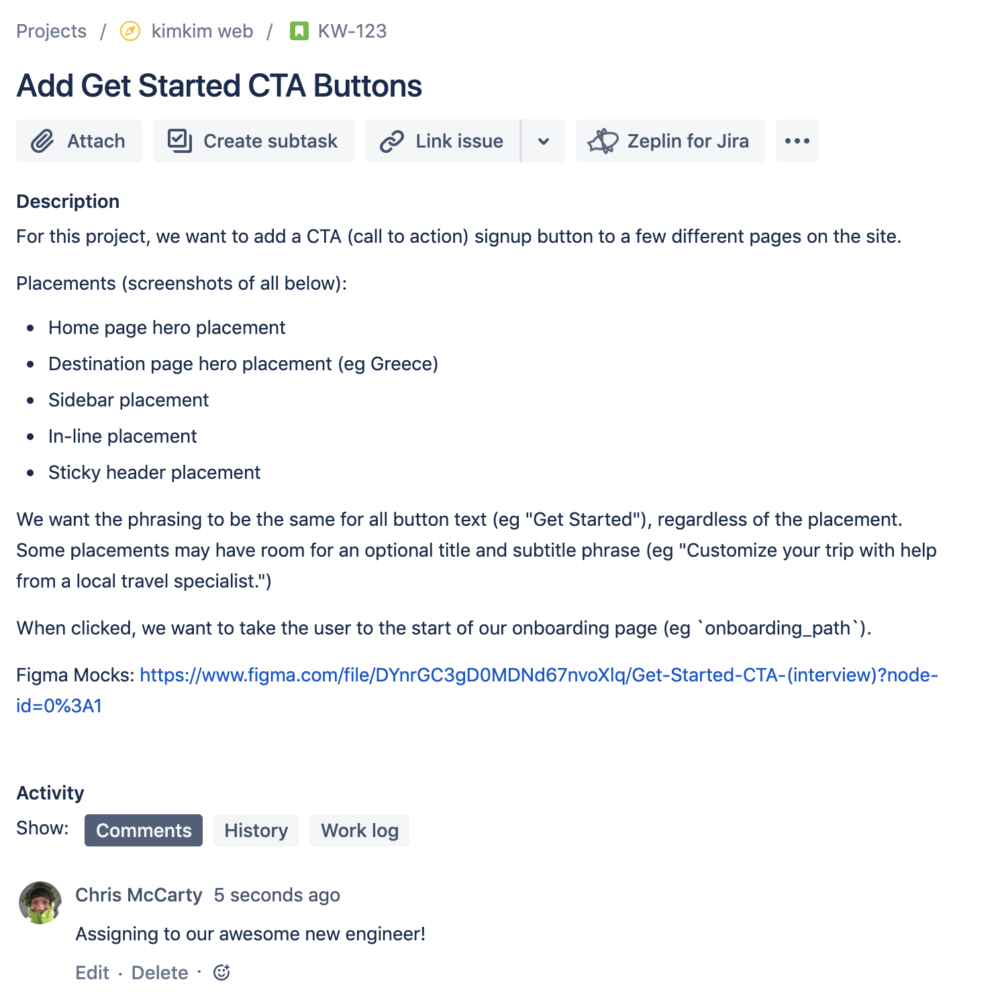

# Let's Get Started!
The goal of this sample project is to mimic a common workflow: reviewing a spec and come up with a (initial) approach.

Write as much code as you need to get your ideas accross, but **you should not fully implement the spec end-to-end for this**. 

You can keep everything in 1 file, just be clear what belongs where.

Feel free to supplement certain areas with pseudocode/comments, but use your judgement on where it's unnecessary to see the level of detail in the design review, and where it's a bit "hand-wavy" to skip important details.

## Spec
### Jira Story
*(text below if the image is unreadable)*

#### Copy in case screenshot is unreadable...
For this project, we want to add a CTA (call to action) signup button to a few different pages on the site.

Placements (screenshots of all below):

* Home page hero placement
* Destination page hero placement (eg Greece)
* Sidebar placement
* In-line placement
* Sticky header placement

We want the phrasing to be the same for all button text (eg "Get Started"), regardless of the placement. Some placements may have room for an optional title and subtitle phrase (eg "Customize your trip with help from a local travel specialist.")

When clicked, we want to take the user to the start of our onboarding page (eg `onboarding_path`).

### Design Mocks
You can find the current mocks in our [shared Figma doc](https://www.figma.com/file/DYnrGC3gD0MDNd67nvoXlq/Get-Started-CTA-interview?node-id=0%3A1)

## Code Design Review
You've read through the spec, looked at the design, and you have a pretty good idea how you are going to approach it.

Before diving in, writing all the code, and submitting a pull request, we are going to have a code design review to go through your planned approach. 

Perhaps the requirements have changed?

### In scope
Prepare your approach and any code/details to help facilitate a thorough discussion of the approach, tradeoffs, etc.

You will need to write *some* code before the review discussion to show your approach and test out a few of your assumptions/ideas to see if they work as you expect they will.

Treat this as if it were a project assigned to you your first week at kimkim. Ask questions, clarifications, bounce ideas if that's helpful.

### Out of scope
Build only what you need in order to be able to communicate your approach to another engineer on the team.

YOU DO NOT need to fully implement this project. This is not intended to be a "takehome project" at that level. It does not need to be complete, be syntactically correct, or "compile/run". But there should be enough structure, scaffolding, placeholders to understand how it works. 

We are more interested in the approach of any logic/helper classes, not the front end views (eg, skip any `.html.erb`, `.css`, `.js` work you may do, assume that's out of scope). 

If you feel like you want to show how your code would handle the end-to-end logic for one of of the placements/views, that's fine (but don't do this for all 5 placements).

Don't worry about multiple files/directory structure/etc. You can put everything in 1 file, just clearly show what belongs where.

## Anything unclear?
Just ask 🙂