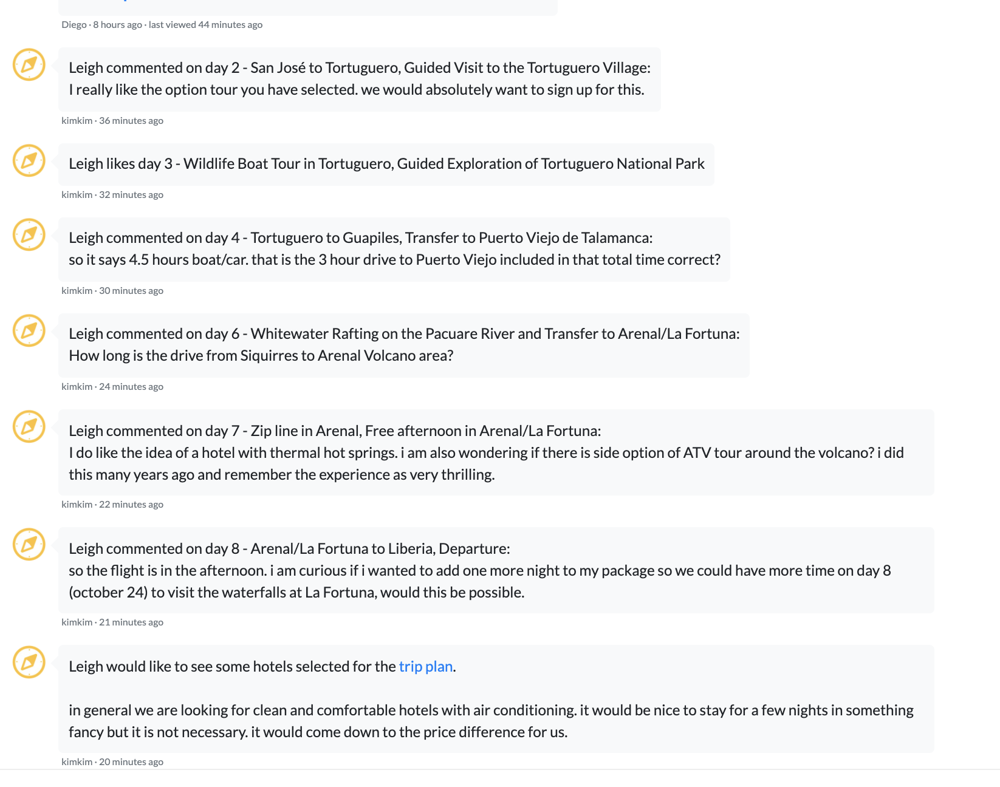
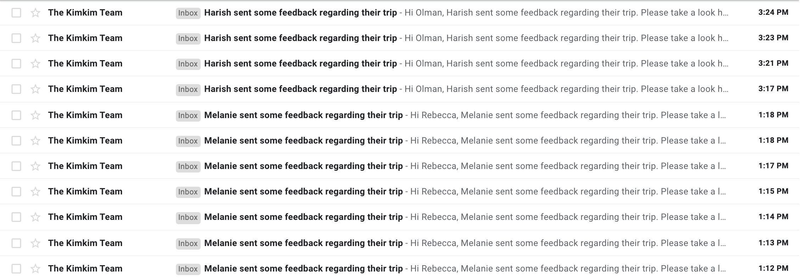

# Delayed Notifications
We want to delay and batch our notifications that we send via email.

We have a way for travelers to easily provide quick feedback to travel specialists about the proposed itinerary, such as the ability to like or comment certain elements such as locations, activities, and hotels.

For each action, we create a new `Message` object in the trip conversation, and send an email to the specialist to let them know that there is new feedback they should be aware of and respond to.

The problem is that people use this feature a lot, and it generates a lot of emails in a row as a result.

Our solution is to batch the emails such that we just send one per "session". This is how we want it to behave. When someone engages with the trip plan, still create the messsage in teh conversation right away, but hold off sending an email for 10 minutes to see if any other notifications happen in the mean time. For each notification, push this time back 10 minutes, so that we send the email only after there are no new notifications for 10 minutes. (If somone adds another comment 2 hours later, that's fine if we send a separate email for that "session").

## Current Structures
Here's some (simplified) code to start with (NOTE: these are real classes, but I've removed some code that's irrelevant for this exercise)

```
class TripPlans::FeedbackController < ApplicationController
  def like
    ...
    message = Message.create(user_id: User.bot.id, trip_id: @trip.id, text: message_text)
    
    # Email the specialist. Every. single. time.
    TripPlanMailer.new_traveler_feedback(trip_id: @trip.id, traveler_id: current_user.id).deliver_later
  end
end

```

What changes would you make to batch the notifications to send only at the end of a 10min like-session?

## Screenshots
Messages in the planning conversation.




Unbatched email overload!
