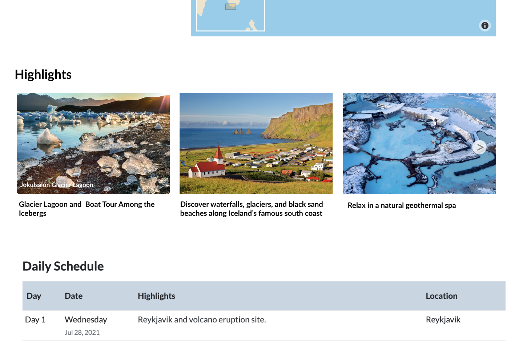
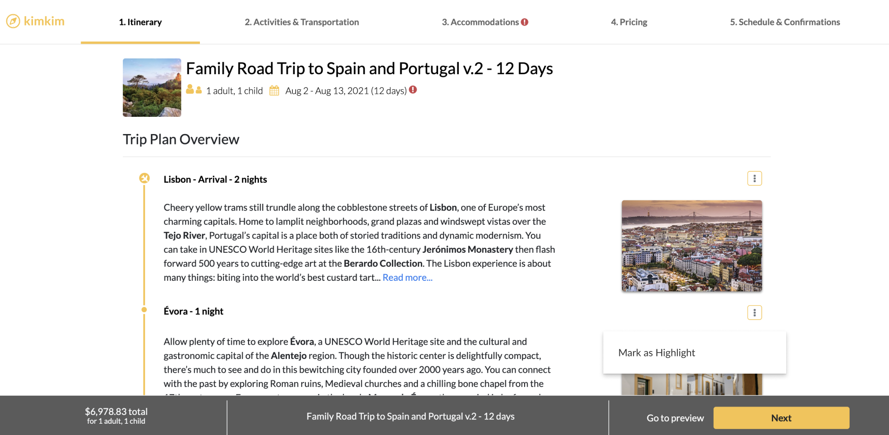
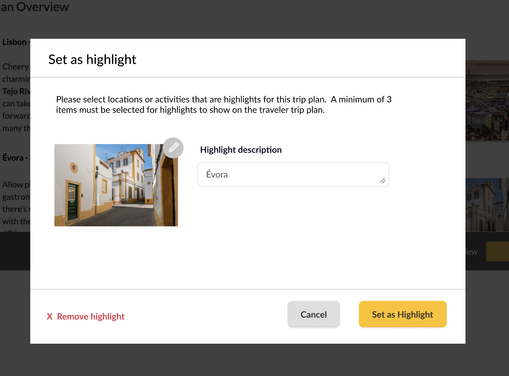

# Itinerary Highlights
Our local travel specialists are designing some great itineraries! Now we want to give them a way to highlight a few key features based on what's most important for a particular traveler.

To start, we want to give specialists the ability to mark a few different types of objects: Locations, Activities, and Hotels (and maybe more in the future...)

There are several possible aspects of this project, here is a general overview, and below I'll outline the scope of sub-projects based on a more front end or backend focus.

## Design Mocks
### Display
This is how we want the highlights to display on the itinerary. We only want to show the row if there are 3+ highlights (otherwise it looks too empty).

### Mark as highlight
Here's an example for a location, but we want to add similar flows for an Activity and/or Hotel (different screens, similar concept). Once a highlight is created from an obect, we want the menu text to change to "Edit highlght" to edit the existing one, not create another new one each time.

When creating/editing the highlight, we set a default photo and name, but we want the option to override either as desired.
