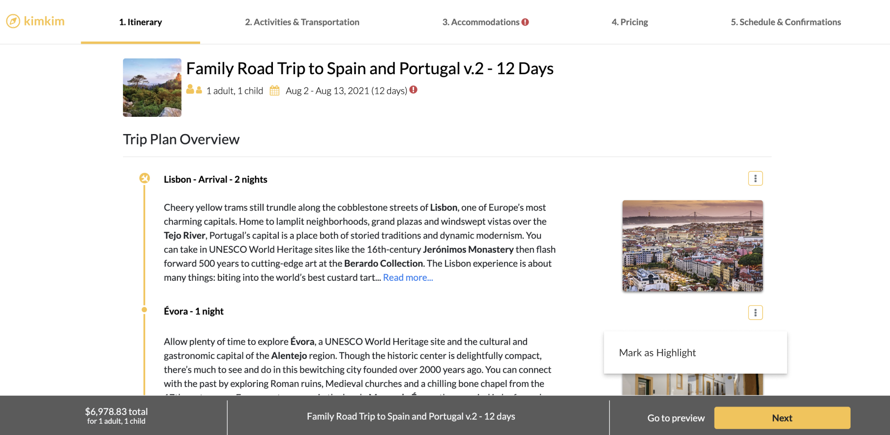
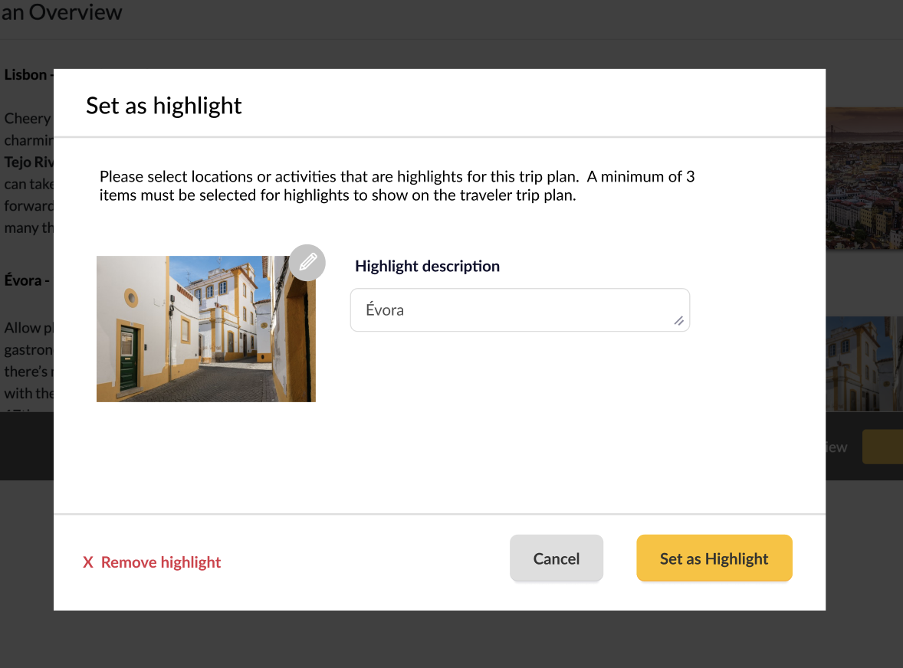

# Itinerary Highlights (v2)
Our local travel specialists are designing some great itineraries! Now we want to give them a way to highlight a few key features based on what's most important for a particular traveler.

We already have some basic highlight infrastruture in place that is being used, so the trick will be to design the improved system and a migration path from the current one (or perhaps you create something completely new and we switch over at some point? You decide, just provide some reasons for your approach).

I'll outline what we currently have, what we want, and give some (simplified) version of different code and structure.

## Interview Format
Our goal is to mimic a typical project as best we can, including a project spec review, decisions on how to implement (especially when there is existing code to work with or around), and finally a bit of code for some places.

Please prepare by familiarizing yourself with this mock spec (this is a real project we are working on, w/ a few things simplified). Then we will set up a call to talk through it together and your proposed approach: how would you structure this on the DB and backend side? What questions do you have? What tradeoffs can/should we make? 

At some point, we'll write a bit of code based on where the discussion leads. It doesn't need to be production-ready by any means, more of a way to see how the different decisions/flows/logic could be implemented.

Please reach out w/ any questions at any time, just as you would for any other typical project.


## What we currently have
We currently have the ability to add/edit text highlights for a `TripPlan`. This gives lots of flexibility for how we use this feature, but it's just text and it's possible that the highlight text drifts from the actual details of the itinerary (eg an activity is removed/adjusted and someoen forgets to remove the highlight for it, or a new activity that's very important to the traveler is added and no corresponding highlights text is added).


```
class TripPlan::Highlight < ActiveRecord::Base
  belongs_to :trip_plan
  belongs_to :photo
  attribute :highlight_text, :string
  attribute :position, :integer
...

end

class TripPlan < ActiveRecord::Base
  ...
end

class Photo < ActiveRecord::Base
  attribute :url, :string
  ...
end
```

## What we want
We want to add a few new concepts to this feature to address the current shortcomings:

1) Sync the highlights to what's in the trip plan (click to mark something as a highlight)
2) Show better content: photo, default highlight text (but still allow for overriding the text)
3) (Bonus) Different default text based on what aspects of the activity we want to showcase (eg, for someone interested in wildlife show a different phrase than someone interested in hiking).

To start, we want to give specialists the ability to mark a few different types of objects: Locations, Activities, and Hotels (and maybe more in the future...). 

In addition to that, we want to be able to pull in some nice default text that we have written with our writers. We do this because we notice that many of our specialists don't take much time to change the text of the highlight from something like "South Coast" to something like "Discover glaciers and black sand beaches along the south coast". We still want to give the specialist the ability to edit this text.

We also want to eventually allow for a more advanced version of this, where we show text about hiking if we know the person likes hiking, or wildlife if we believe they are more interested in wildlife.


## Design Mocks
### Display
This is how we want the highlights to display on the itinerary (photo and title, you can ignore the photo caption). 
We only want to show the row if there are 3+ highlights (otherwise it looks too empty).


### Mark as highlight
Here's an example for a location, but we want to add similar flows for an Activity and/or Hotel (different screens, similar concept). Note: Don't worry about coding the UI for any of this part.




When creating/editing the highlight, we set a default photo and highlight text, but we want the option to override either as desired.

We want the following logic:
- If we have editor-written default text for this particular object, set that by default (you decide how to handle the case where we may have multiple options, say one focused on hiking and one more focused on wildlife or food).
- Otherwise, fallback to the name of the object
- Always let the user override any text set.




## Code
Here is some (very) boilerplate code to get you oriented, in addition to the `TripPlan`, `TripPlan::Highlight`, `Photo` classes above.

```
class Location < ActiveRecord::Base
  attribute :name, :string
  belongs_to :photo
  ...
end

class Activity < ActiveRecord::Base
  attribute :name, :string
  belongs_to :photo
  ...
end

class Hotel < ActiveRecord::Base
  attribute :name, :string
  belongs_to :photo
  ...
end

```

## Deliverables 
Pretend we are going to have an engineering design review, also with the product team to decide how to structure all of this, what new models to create, etc. 

Put together a rough outline of ideas, questions, changes/additions to models, services, decorators, controllers, DB, whatever you recommend. This shouldn't be a fully coded implementation, but it should be enough to have a conversation around.

Send this to us before we chat so that we can prepare a few questions based on it.

During a shared screen call, walk us through your choices, tradeoffs you encountered, and what led you to your recommendation.

Separately, we'll find a time to do a bit of live coding for some of the elements together, to see how the overall strcture would work.
