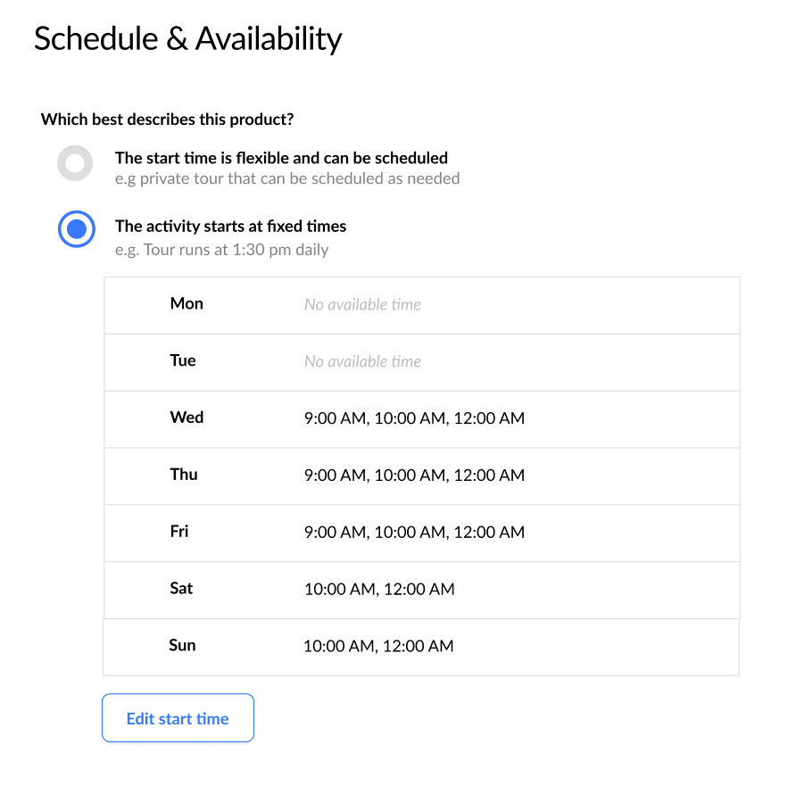
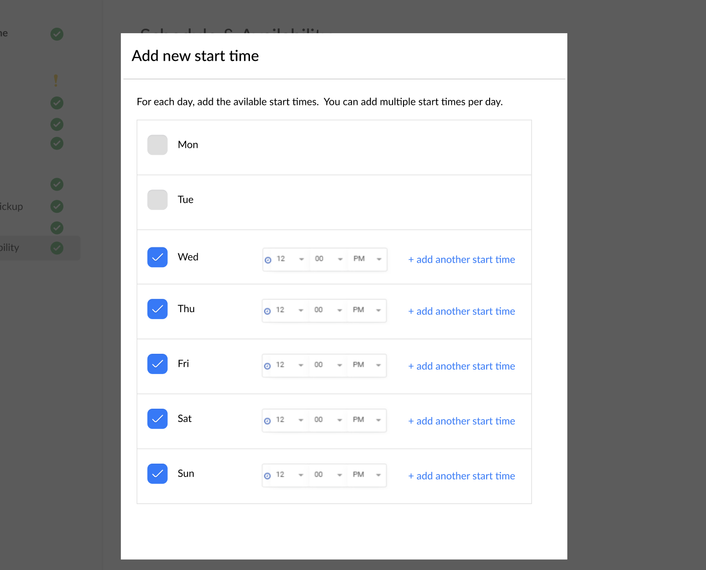
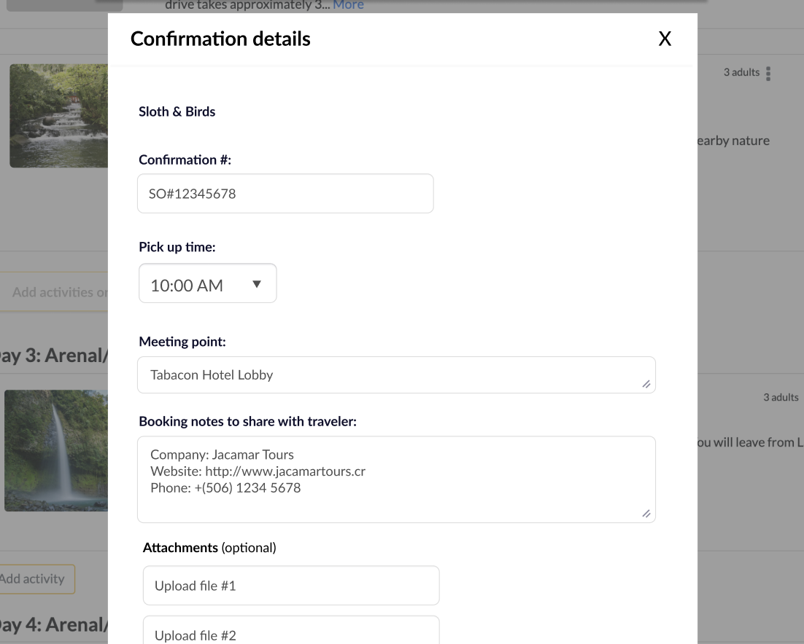
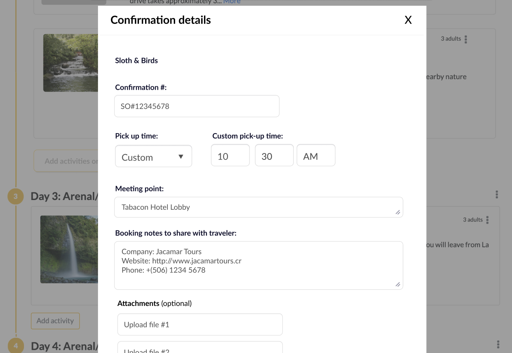

# Meeting Times
For each activity, we give our travel specialists the ability to add additional useful information when marking it as "confirmed" in their Operations view. One key piece of info is the meeting time and location. Currently, have a time picker UI for this for each activity, but it has led to some mistakes with adding the wrong time.

To reduce mistakes, we want to move to a more structured representation of meeting times for each activity.

There are many components to this, please focus just on the areas we ask you to focus on (eg maybe just the DB structure, or the creating UI, or the selecting UI).


## Current Code
Here's a similified overview of the code and models related to this

### Postgres DB
```
Table "public.activities"

       Column       |            Type             |
--------------------+-----------------------------+
 id                 | bigint                      |
 name               | character varying           |
 description        | text                        |
 category           | integer                     |
 destination_id     | bigint                      |
 user_id            | bigint                      |
 group_type         | integer                     |
 post_booking_notes | text                        |
 created_at         | timestamp without time zone |
 updated_at         | timestamp without time zone |
 
Indexes:
    "addons_pkey" PRIMARY KEY, btree (id)


Table "public.activity_bookings"

      Column          |              Type              |
----------------------+--------------------------------+
 id                   | bigint                         |
 activity_id          | bigint                         |
 amount               | numeric(8,2)                   |
 connfirmation_number | character varying              |
 meeting_time         | time without time zone         |
 end_time             | time without time zone         |
 created_at           | timestamp(6) without time zone |
 updated_at           | timestamp(6) without time zone |
 
Indexes:
    "activity_bookings" PRIMARY KEY, btree (id)
Foreign-key constraints:
    "fk_rails_922cbfa6e3" FOREIGN KEY (activity_id) REFERENCES activities(id)
```

### Models
```
class Activity::Booking < ApplicationRecord
  belongs_to :activity
  
  # Override getters/setters to force to UTC and avoid any time converstions (we always display as local time: 9am is just 9am)
  def meeting_time
    self[:meeting_time]&.in_time_zone('UTC')
  end

  def meeting_time=(t)
    self[:meeting_time] = t.in_time_zone('UTC')
  end
end
```


### Views
```
/views/activities/bookings/_form.html.erb

...
<div>
  <label>Meeting time:</label>
  <%= f.time_field :meeting_time %>
</div>
...
````

## Design Mocks
### Edit Activity
Edit an activity, see the current strucutred meeting times for each day of the week


Edit/add additional start times for any given day.


### Edit Activity Booking Information
This is where the specialist can either select one of the pre-created start times


Or select "Custom" to still set any time they want (not used as often anymore, but still possible)


